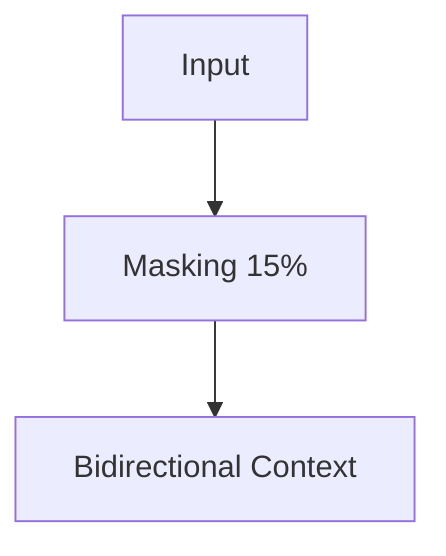

# The Bidirectional MLM Revolution (BERT, Devlin et al., 2018)

The introduction of bidirectional context via masking.

## Diagram

```mermaid
graph TD
 A[Input] --> B[Masking 15%]
 B --> C[Bidirectional Context]
```
