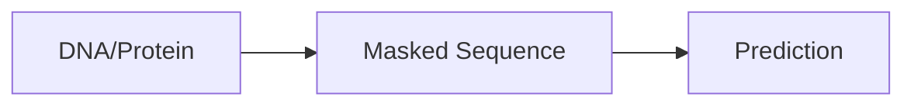

# Biomedical & Genomic Sequence Modeling (DNABERT / ESM)

Applying MLM to genomic and amino acid sequences.

## Diagram

```mermaid
graph LR
 A[DNA/Protein] --> B[Masked Sequence] --> C[Prediction]
```
