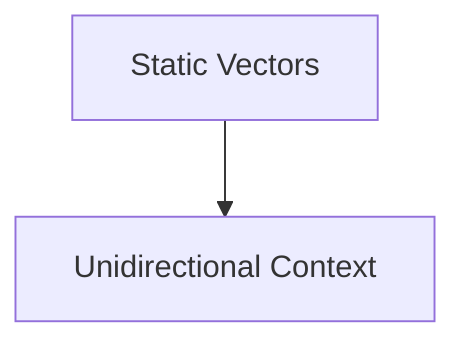

# The Feature-Based & Unidirectional Era (Word2Vec / GPT-1, 2013–2018)

A shift from static to contextual but unidirectional.

## Diagram

```mermaid
graph TD
 A[Static Vectors] --> B[Unidirectional Context]
```
